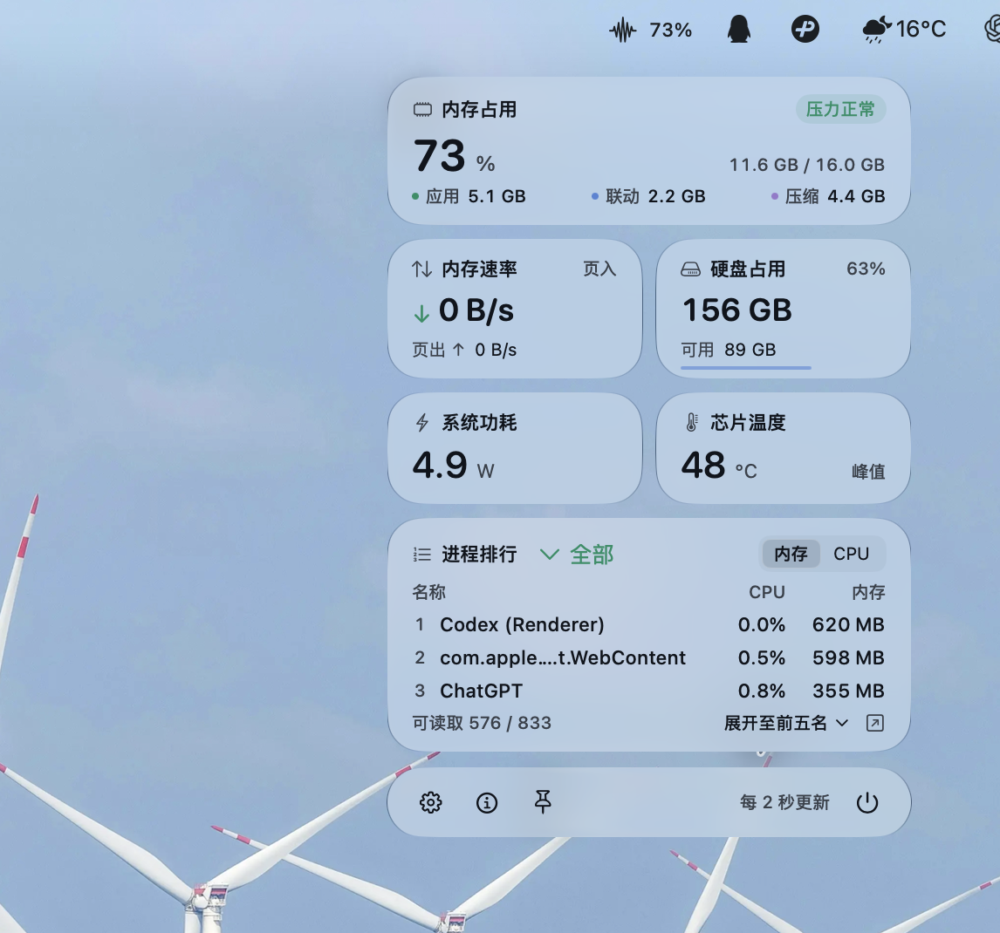
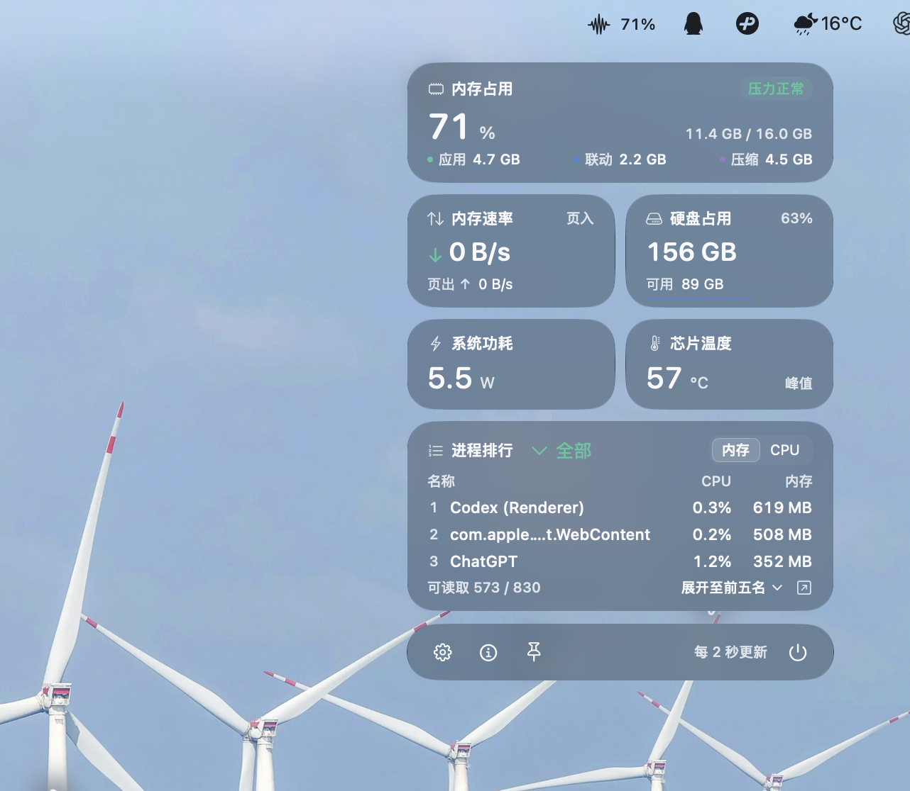

# 轻览 · Qinglan

轻量、简洁的 macOS 菜单栏状态监测工具。点开菜单栏，就能看到内存、分页活动、硬盘、进程、功耗与温度。

原生 SwiftUI + AppKit，透明玻璃卡片，跟随系统浅色与深色外观。

[下载最新版本](https://github.com/eClip8e-coder/Qinglan/releases/latest) · [数据口径与实现说明](docs/TECHNICAL.md)

## 界面预览

| 浅色模式 | 深色模式 |
| :---: | :---: |
|  |  |

实际效果会随系统版本、桌面背景与辅助功能设置变化。

## 功能

- **内存占用**：使用比例、应用 / 联动 / 压缩内存，以及系统内存压力。
- **内存活动**：实时页入 / 页出速率。
- **硬盘占用**：启动盘已用、可用容量和占用比例。
- **进程排行**：默认前三名，一键展开至前五名；按内存或 CPU 排序，支持全部 / 后台筛选。
- **系统功耗与芯片温度**：读取可用的功率与温度传感器，无法读取时明确显示暂不可用。
- **菜单栏常驻**：固定面板、登录启动、采样间隔和菜单栏显示设置。

没有历史曲线，没有持续动效。面板收起后降低采样频率并暂停进程枚举，睡眠时停止采样。无第三方运行时依赖、无网络请求、无特权后台服务。

## 安装

1. 在 [Releases](https://github.com/eClip8e-coder/Qinglan/releases) 下载 `Qinglan-1.0.7-macOS-arm64.zip`。
2. 解压，将 **轻览.app** 拖入“应用程序”文件夹并打开。
3. 点击菜单栏的波形图标。底部图钉固定面板，齿轮打开设置，电源按钮退出。

当前下载包为 **Apple Silicon（arm64）** 版本，已在 **Apple M4 / macOS 27** 上验证。最低部署目标为 macOS 13；其他系统与硬件组合尚未完整实测。macOS 26 以下使用磨砂材质。

下载包采用 ad-hoc 签名，尚未经过 Developer ID 签名与 Apple 公证。macOS 可能阻止首次打开；确认下载来源后，可在“系统设置 → 隐私与安全性”中按系统提示处理，或从源码构建。

## 从源码构建

需要 Swift 工具链及 **macOS 27 SDK**（代码使用该 SDK 的玻璃接口；已用 Swift 6.4 验证）。使用 Xcode 或包含对应 SDK 的 Command Line Tools。

```sh
git clone https://github.com/eClip8e-coder/Qinglan.git
cd Qinglan
bash scripts/build.sh
bash scripts/test.sh
open dist/轻览.app
```

构建脚本生成 `dist/轻览.app`，并进行本机 ad-hoc 签名。构建架构取决于本机工具链；当前发布包不包含 Intel 二进制。

## 数据说明

内存速率表示分页活动，并非 DRAM 带宽或内存频率。进程内存采用 RSS；CPU 100% 对应一个逻辑核心。温度是当前芯片热区的最高读数，功耗优先采用 SMC 系统总功率，不等同于插座功率。

玻璃外观与传感器读取包含非公开系统接口，系统更新可能影响兼容性。完整的数据来源、回退逻辑与限制见 [技术说明](docs/TECHNICAL.md)。

## 项目结构

```text
Sources/Qinglan       菜单栏、面板、设置与采样调度
Sources/MonitorCore   数据模型、指标计算与采集
Sources/SystemProbe   Mach / libproc / IOKit 只读接口
Tests                 指标与边界检查
Resources             应用信息与图标
scripts               构建、检查与图标生成
```

## 参考

界面早期参考 [Lens 透镜](https://ruiqichenbiec.github.io/design-systems/lens/lens-showcase.html)，玻璃与传感器实现参考 Apple 文档、[Qt Liquid Glass](https://github.com/fsalinas26/qt-liquid-glass) 和 [Stats](https://github.com/exelban/stats)。相关接口出处见 [技术说明](docs/TECHNICAL.md#接口参考)。
